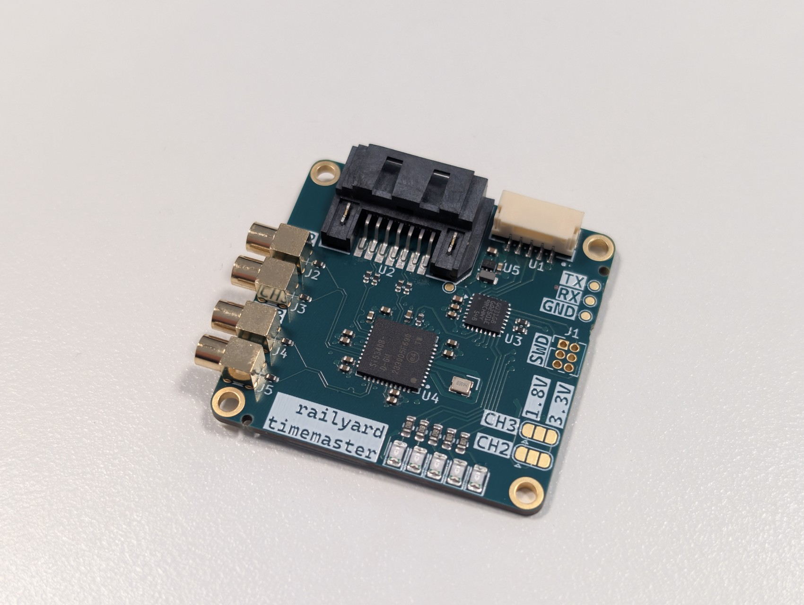

# Timemaster

A Si5340-based clock generator board with two clocks available via a SATA connector, and 2 clocks available via MMCX connectors. All clocks are differential.

Includes a STM32G031G8Ux microcontroller to manage the Si5340, accessible over via I2C on the JST-GH connector.

5 debug LEDs are available to the STM32.

